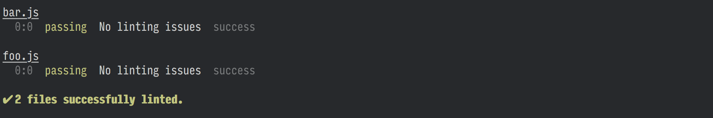

# eslint-formatter-stylish-verbose
[](https://travis-ci.org/jacquesd/eslint-formatter-stylish-verbose)
[](https://codecov.io/gh/jacquesd/eslint-formatter-stylish-verbose)
[](https://github.com/jacquesd/eslint-formatter-stylish-verbose/blob/master/LICENSE)
[](https://www.npmjs.com/package/eslint-formatter-stylish-verbose)

> Modified version of the [stylish reporter](https://github.com/eslint/eslint/blob/master/tests/lib/formatters/stylish.js) for [ESLint](https://eslint.org) which logs files without warning/errors.



## Install

```
$ npm install --save-dev eslint-formatter-stylish-verbose
```

## Usage

### ESLint CLI

```
$ eslint --format=stylish-verbose file.js
```

### [grunt-eslint](https://github.com/sindresorhus/grunt-eslint)

```js
grunt.initConfig({
	eslint: {
		target: ['file.js'].
		options: {
			format: 'stylish-verbose'
		}
	}
});

grunt.loadNpmTasks('grunt-eslint');
grunt.registerTask('default', ['eslint']);
```

### [gulp-eslint](https://github.com/adametry/gulp-eslint)

```js
const gulp = require('gulp');
const eslint = require('gulp-eslint');

gulp.task('lint', () =>
	gulp.src('file.js')
		.pipe(eslint())
		.pipe(eslint.format('stylish-verbose'))
);
```

### [eslint-loader](https://github.com/MoOx/eslint-loader) *(webpack)*

```js
module.exports = {
	entry: ['file.js'],
	module: {
		rules: [
			{
				test: /\.js$/,
				exclude: /node_modules/,
				loader: 'eslint-loader',
				options: {
					formatter: require('eslint-formatter-stylish-verbose')
				}
			}
		]
	}
};
```

## License

MIT © [Jacques Dafflon](https://sindresorhus.com)

## Credits

Credits for the [original implementation of the stylish reporter](https://github.com/eslint/eslint/blob/master/tests/lib/formatters/stylish.js) go to Sindre Sorhus, @[sindresorhus](https://github.com/sindresorhus).

This README is adapted from the [original README](https://github.com/sindresorhus/eslint-stylish/blob/master/readme.md) of---the now [deprecated version](https://github.com/sindresorhus/eslint-stylish) of---the stylish reporter.
